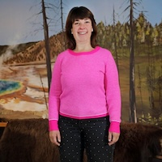

Join us for an evening of fun and networking.  Grab some food and drinks, mingle with other conference participants, watch a planetarium show, and experience a small group exhibit tour (improv comedy-style from the MOR’s very own Chelsea Hogan) to finish your day with LOL!

## Time

6:00PM - 8:00PM
Monday, Aug. 5, 2024

## Where

Museum of the Rockies
- [Location](https://maps.app.goo.gl/jp6wgcGDUhDS2xvi8) for driving directions
- [Directions](https://maps.app.goo.gl/dTPQwiDzmc5JKjDq5) if walking from Norm Asbjornson Hall

## What
- Food and drinks
- Small group exhibit tours (improv comedy style)! 
- Planetarium show
- Networking with other educators and STEM enthusiasts
- Explore museum education outreach resources 

***

## Chelsea Hogan

Chelsea Hogan is the Director of Education and Public Programming at Museum of the Rockies. She oversees the School, Youth, Adult, and Volunteer Programs and the Tinsley House and Living History Farm. She holds a Master of Artis in teaching museum education and a Bachelor of Arts in art history. Before this role, she worked in museum education in art museums in Los Angeles and Washington, D.C. 

In addition to museum work, Chelsea is an experienced improviser and comedian who has performed and taught worldwide. Chelsea loves to incorporate theater into museum programming and teaches improv workshops for those looking to gain confidence, make bold choices, and incorporate more play into their lives. Since 2016, Chelsea has run her own project called "MuseumProv," where she trains museum frontline workers and educators improv skills to better educate and work with the public. Most of all, Chelsea loves hiking with her dog, Taika.