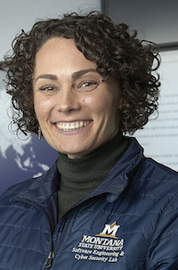

Dr. Ann Marie Reinhold is an Assistant Professor in the Gianforte School of Computing and Co-Director of the Software Engineering and Cybersecurity Lab at Montana State University in Bozeman, MT USA. She is a data scientist who specializes in the development and application of computational methods to understand the mechanisms underpinning pressing environmental, societal, and cybersecurity problems.

## Obstacles as Opportunities: Viewing the World through the Lens of a Data Scientist

Dr. Ann Marie Reinhold is a Data Scientist, Assistant Professor in the Gianforte School of Computing, and Co-Director of the SECL Montana State University in Bozeman. Dr. Reinhold is a data scientist who specializes in the development and application of computational methods to understand the mechanisms underpinning pressing environmental, societal, and cybersecurity problems.

### Location
Inspiration Hall